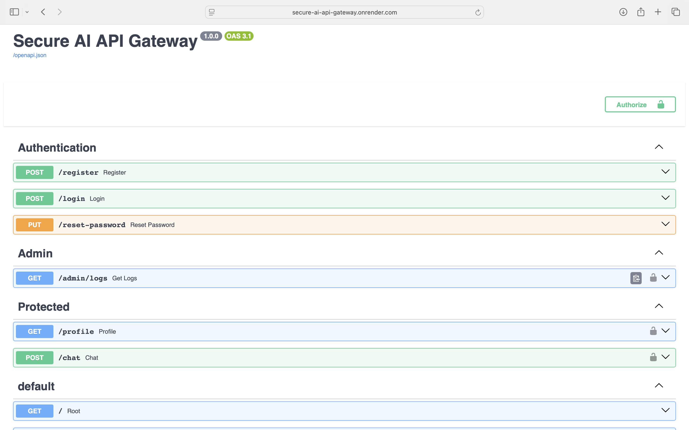
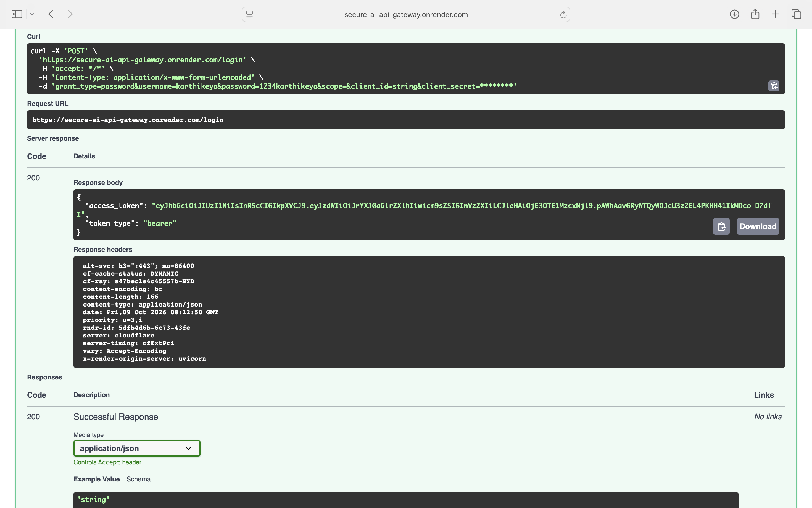
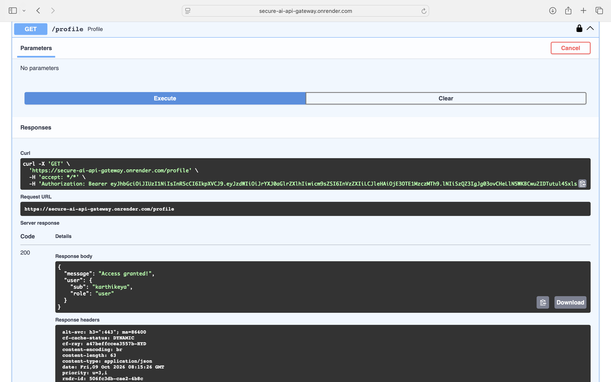
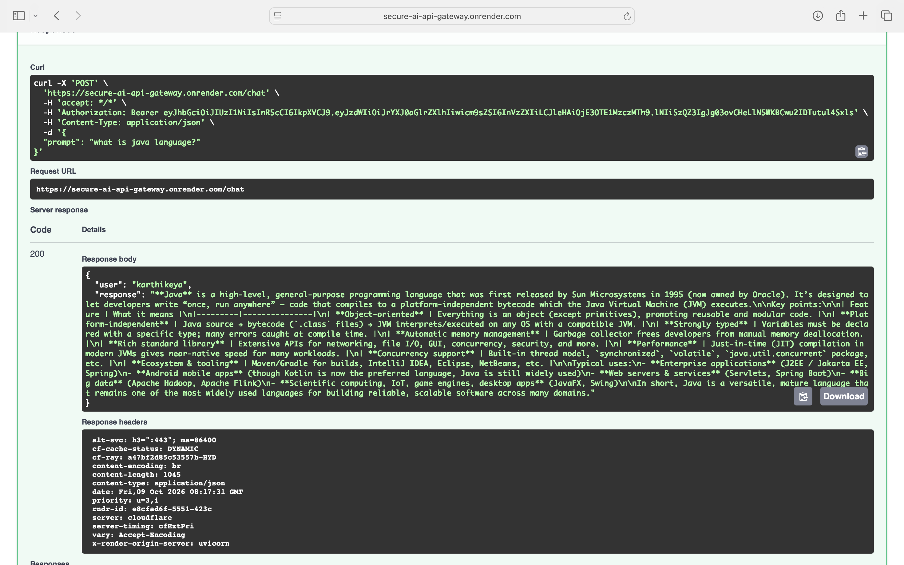
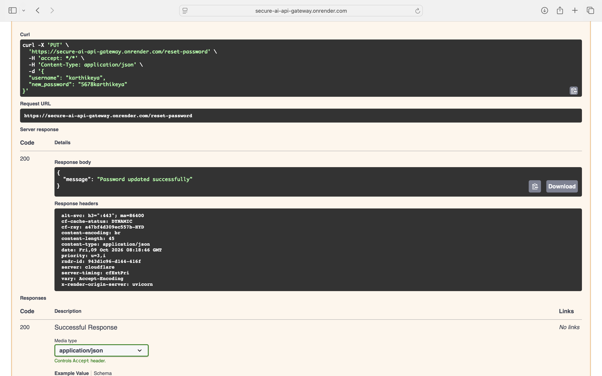
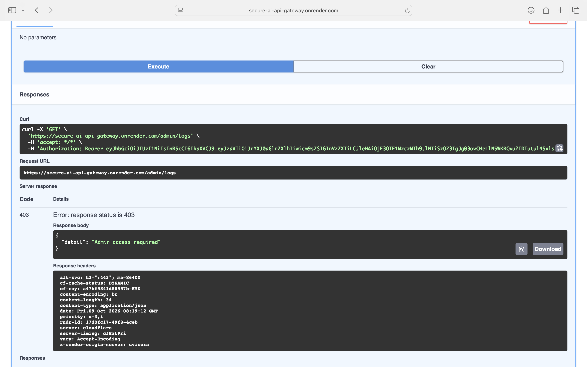

# 🔐 Secure AI API Gateway

A security-focused AI API Gateway built with **Python, FastAPI, and Groq**.

This project provides secure access to LLM APIs with **JWT authentication, Role-Based Access Control (RBAC), prompt-injection detection, rate limiting, and audit logging**.

Built to demonstrate practical backend engineering, API security, and AI/LLM integration.

---

## 🚀 Live Demo

| Service | URL |
|---|---|
| Live API | https://secure-ai-api-gateway.onrender.com |
| Swagger UI | https://secure-ai-api-gateway.onrender.com/docs |
| ReDoc | https://secure-ai-api-gateway.onrender.com/redoc |
| Health Check | https://secure-ai-api-gateway.onrender.com/health |
| GitHub | https://github.com/Karthikeya172001/secure-ai-api-gateway |

---

## ✨ Features

- JWT authentication
- Role-Based Access Control (RBAC)
- Password hashing with bcrypt
- Protected REST API endpoints
- LLM integration using Groq
- Prompt-injection detection
- API rate limiting
- Audit logging
- Swagger / OpenAPI documentation
- Pytest automated testing
- Render cloud deployment

---

## 🛠️ Tech Stack

- Python
- FastAPI
- SQLAlchemy
- SQLite
- JWT
- bcrypt / Passlib
- Pydantic
- Groq API
- SlowAPI
- Pytest
- Swagger / OpenAPI
- Render

---

## 🏗️ Architecture

```text
Client
  |
  v
FastAPI REST API
  |
  +-- Rate Limiting
  |
  +-- JWT Authentication
  |      |
  |      +-- RBAC
  |
  +-- Protected APIs
  |      |
  |      +-- Prompt Injection Detection
  |      |
  |      +-- Groq LLM
  |
  +-- Admin APIs
         |
         +-- Audit Logging
                |
                v
              SQLite
```

---

## 🛡️ Security Testing

The deployed API was tested through Swagger UI.

### JWT Authentication

```text
GET /profile
→ 200 OK
```

### Role-Based Access Control

A normal user attempting to access the admin endpoint is rejected.

```text
GET /admin/logs
→ 403 Forbidden
→ Admin access required
```

### Prompt Injection Detection

```text
POST /chat
→ 400 Bad Request
→ Blocked suspicious prompt
```

### Rate Limiting

The `/chat` endpoint enforces a limit of 5 requests per minute.

```text
POST /chat
→ 429 Too Many Requests
→ Rate limit exceeded
```

### Successful AI Request

```text
POST /chat
→ 200 OK
→ AI response
```

---

## 📸 Screenshots

### Swagger UI



### User Registration


### User Login



### Protected Profile



### AI Chat



### Password Reset



### Admin Audit Logs



---

## 📂 Project Structure

```text
secure-ai-api-gateway/
|
+-- app/
|   +-- __init__.py
|   +-- admin.py
|   +-- auth.py
|   +-- database.py
|   +-- limiter.py
|   +-- llm.py
|   +-- logger.py
|   +-- main.py
|   +-- models.py
|   +-- prompt_filter.py
|   +-- routes.py
|   +-- schemas.py
|   +-- security.py
|
+-- screenshots/
+-- tests/
+-- .gitignore
+-- Dockerfile
+-- pytest.ini
+-- render.yaml
+-- requirements.txt
+-- README.md
```

---

## ⚙️ Local Setup

### 1. Clone the repository

```bash
git clone https://github.com/Karthikeya172001/secure-ai-api-gateway.git
cd secure-ai-api-gateway
```

### 2. Create a virtual environment

```bash
python -m venv .venv
```

### 3. Activate the virtual environment

**Windows**

```bash
.venv\Scripts\activate
```

**Linux / macOS**

```bash
source .venv/bin/activate
```

### 4. Install dependencies

```bash
pip install -r requirements.txt
```

### 5. Configure environment variables

Create a `.env` file in the project root:

```env
SECRET_KEY=your_secret_key
GROQ_API_KEY=your_groq_api_key
```

Never commit real API keys, JWT secrets, or passwords to GitHub.

### 6. Run the application

```bash
uvicorn app.main:app --reload
```

Open Swagger UI:

http://127.0.0.1:8000/docs

---

## 📡 API Endpoints

| Method | Endpoint | Description |
|---|---|---|
| POST | `/register` | Register a user |
| POST | `/login` | Login and receive JWT |
| PUT | `/reset-password` | Reset password |
| GET | `/profile` | Get authenticated profile |
| POST | `/chat` | Send a prompt to AI |
| GET | `/admin/logs` | View audit logs |
| GET | `/health` | API health check |

---

## 🤖 AI Integration

The gateway uses Groq's OpenAI-compatible API to process authenticated AI requests.

### Example Request

```json
{
  "prompt": "What is JWT authentication?"
}
```

### Example Response

```json
{
  "user": "authenticated_user",
  "response": "AI-generated response..."
}
```

---

## 🧪 Testing

Run the automated tests locally:

```bash
pytest
```

The deployed API was also manually tested for:

- JWT authentication
- RBAC authorization
- Prompt-injection blocking
- Rate limiting
- Successful AI responses

---

## 👨‍💻 Author

**Gorityala Karthikeya**

Software Engineer | Python | FastAPI | Backend | AI/LLM | API Security

Email: gorityalakarthikey@gmail.com

LinkedIn: https://www.linkedin.com/in/karthikeya-gorityala

GitHub: https://github.com/Karthikeya172001

Project: https://github.com/Karthikeya172001/secure-ai-api-gateway
